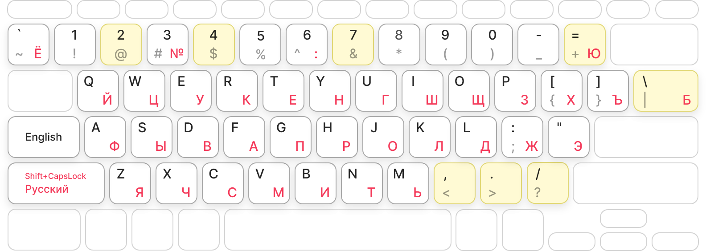
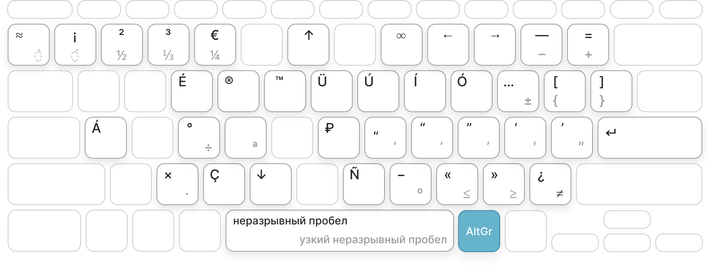

# Универсальная раскладка Ситника

* **Немодальное переключение языка.** <kbd>CapsLock</kbd> — всегда
  на английский. <kbd>Shift</kbd>+<kbd>CapsLock</kbd> — всегда на русский.
  Светодиод CapsLock указывает на текущий язык.
* **Общие знаки препинания.** `,` `.` `?` совпадают во всех раскладках.
* **Английская раскладка без изменений.** В русской раскладке сдвинуты только 2
  буквы — <kbd>Б</kbd> и <kbd>Ю</kbd>.
* Можно быстро вводить **типографические символы** — «правильные кавычки»,
  длинное тире и много других символы (15°C, м², ⅓, ≠, →, неразрывный пробел).
* Можно вводить **испанский** и **каталонский** текст на английской
  ANSI-клавиатуре. Включая ¿, ¡, l·l.






## Мотивация

Альтернативные раскладки — не для всех. Если вы не находите себя в списке ниже,
то она вам не нужна.

1. Вы часто замечаете, что переключаетесь на английский,
   чтобы ввести пунктуацию.
2. Вы используете только свои клавиатуры для ввода русского текста —
   например, живёте заграницей.
3. Не хочется менять английскую раскладку — у вас есть клавиатура с английской
   гравировкой или вы планируете использовать чужие клавиатуры.
4. Вам иногда нужно вводить испанский или каталонский текст.


## Установка

Установка не меняет глобальные файлы. Всё ставиться в `~/.config/` в директории
пользователя.

```sh
mkdir -p ~/.config/xkb/symbols/ ~/.config/xkb/rules/
curl -o ~/.config/xkb/symbols/universal_en https://raw.githubusercontent.com/ai/universal-layout/main/universal_en.xkb
curl -o ~/.config/xkb/symbols/universal_ru https://raw.githubusercontent.com/ai/universal-layout/main/universal_ru.xkb
curl -o ~/.config/xkb/rules/evdev.xml https://raw.githubusercontent.com/ai/universal-layout/main/evdev.xml
dconf write /org/gnome/desktop/input-sources/xkb-options "['grp_led:caps', 'lv3:ralt_switch', 'grp:shift_caps_switch']"
```

Перезапустите систему.

Выберите `Russian Universal` и `English/Spanish/Catalan Universal`
в настройках клавиатуры.


## Альтернативы

Проект вдохновлялся проектами:

* [Раскладка Никиты Широкова](https://github.com/braindefender/universal-layout)
* [Раскладка Никиты Прокопова](https://github.com/tonsky/Universal-Layout)
* Встроенная в Линукс раскладка `misc:typo`, копия
  [Раскладки Бирмана](https://ilyabirman.ru/typography-layout/)
